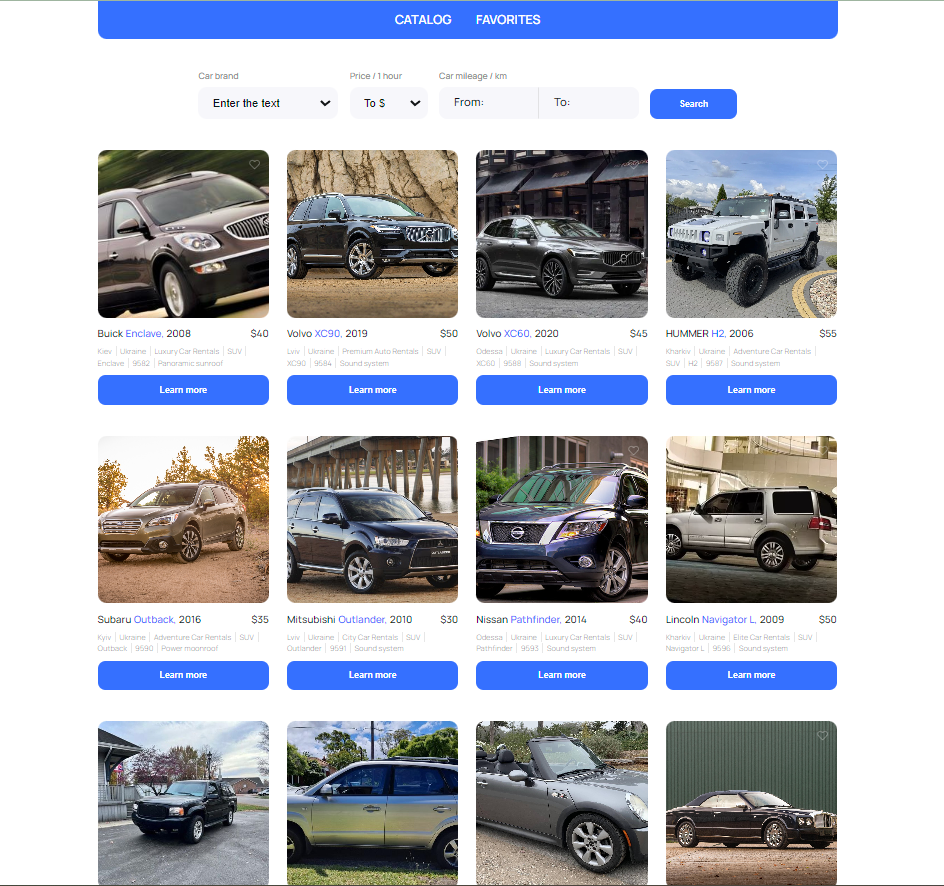
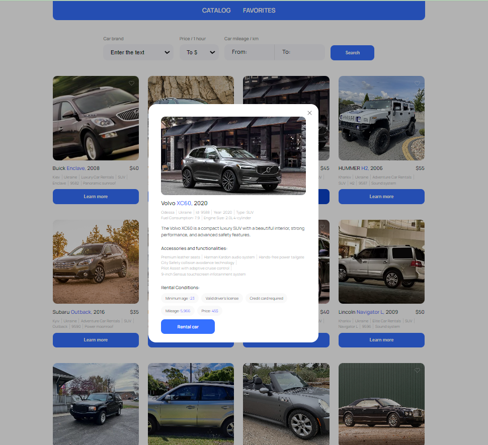
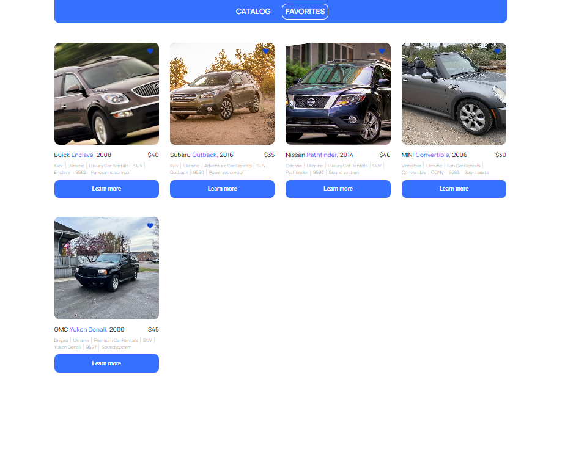

<h1 style="text-align: center; color: #3470ff;">Rental Cars App</h1>

A car rental app is an online platform that allows users to rent cars for
personal or business use. The app provides an easy-to-use interface for
searching and booking, as well as storing your favourite cars. The app has a
wide selection of cars that vary in make, model, size and price.

<h2 style="color: #3470ff;">Build with:</h2>
<ul>
    <li>- React JS</li>
    <li>- Redux</li>
</ul>

<h2 style="color: #3470ff;">Screenshots of the Project:</h2>

